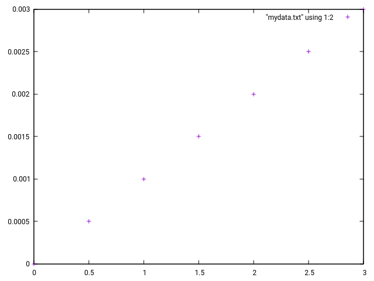

# Getting Started

To run a Gnucap analysis of an electrical circuit, you require a netlist. A netlist is a representation of a circuit and its different components such as voltage sources, resistors or transistors.

Entering a simple netlist and running an analysis is a good start to learn some basic Gnucap commands. Commands can be entered either in interactive or batch simulation mode. If you prefer a GUI to work with a netlist, there exist Gnucap plugins that allow you to capture a netlist and run an analysis with help of external programs such as [Qucs](http://qucs.sourceforge.net/) or [gEda](http://www.geda-project.org/).

The purpose of this chapter however is to look at the most important commands for electrical simulations. After having read this chapter, you should have a feeling on how to write a netlist (a schematic), add probes for an analysis, then run a simulation and capture its output.

Once you are able to load a netlist and start a simulation, the data from a simulation can be plotted with help of the plotting function or a plotting program. This will be discussed at the end of this chapter.


## Overview on Simulator Modes

The interactive mode is helpful for doing small simulations and learning purposes. The interactive mode allows you to "build" a netlist manually by defining nodes and voltage/current sources line by line.

For larger circuits and simulations, you can prepare your simulation in a ckt or spice file. In batch mode, you can load the netlist and run the simulation without manual interventions.

Besides different modes for simulations, Gnucap also supports different formats for defining netlists. This will be discussed below in the Verilog part of the chapter.

Let`s first look at the basics of the interactive mode.


## Interactive Mode

The interactive mode will be started if you run Gnucap without arguments:

```
~$ gnucap
Gnucap : The Gnu Circuit Analysis Package
Never trust any version less than 1.0
Copyright 1982-2013, Albert Davis
Gnucap comes with ABSOLUTELY NO WARRANTY
This is free software, and you are welcome
to redistribute it under the terms of
the GNU General Public License, version 3 or later.
See the file "COPYING" for details.
main version: master 2017.10.03
core-lib version: master 2017.10.03
default plugins: master 2017.10.03
gnucap>
```

The gnucap prompt allows you to enter different commands. Unfortunately, there is no built-in help. The best place to get information on Gnucap commands is the [documentation](https://www.gnu.org/software/gnucap/gnucap-man.pdf).

Also, a number of Gnucap commands can be seen in the source file "c__cmd.cc" :

     build
     modify
     delete
     list
     include
     generator
     transient
     fourier
     options
     param
     print
     status
     temperature
     system
     quit
     <
     >

Commands can be abbreviated with their first letter, e.g. "b" for build. As this command is important let's see how it works.

### Building a netlist

The first command you want to learn are the commands to enter a netlist. These commands are:
* "build": This command will bring up a small line editor to enter a netlist
* "list": The command will show the netlist that is currently loaded.
* "modify": This command allows you to modify a component in a netlist
* "delete": This command deletes an item in the netlist

First, take a look below for a very basic build example:

```
gnucap> build
Vsrc 1 0 5
Rload 1 0 1k
<empty line>
```

Note the empty line to end "building" the netlist. You can later add new components with the "modify" command.

Once you have entered the netlist, you can inspect the netlist with "list":

```
gnucap> list
Vsrc ( 1 0 )  DC  5.
Rload ( 1 0 )  1.K
gnucap>
```

This is a very simple netlist with only 2 components. 

### Loading circuits with get

One more strategy can be helpful to load a netlist. Instead of using "build" to enter all nodes, you can use "get" to load a prepared netlist.

So you can enter a netlist with a text editor in a file myckt.ckt:

```
-- An example
Vsrc 1 0 5
Rload 1 0 1k
```

Note the first line should include a comment of the circuit. This is a convention from Spice syntax. And Spice syntax is very widely used.

Now in Gnucap you can just enter:

```
gnucap> get myckt.ckt
```
If you run "list" now, you will see the same netlist as was entered with build.

Besides "get" there is also the "include" command. The include command executes the commands which are defined in the ckt file. This can be useful to setup parameters and options which will be discussed later.

Let's continue how circuits can be analyzed.


### Adding probes

To do an analysis, you first need to think what to measure and how. In Gnucap, you need to take a look at the "print" command. In the documentation you will see: "The ‘print’ command selects where to look at the circuit, or where to hook the voltmeter (ammeter, wattmeter, ohm meter, etc.) probe."

If you play with "print" in the Gnucap console you will see:

```
gnucap> print
tran
ac
dc
op
fourier
gnucap> print op
```

The modes for analysis are:

* op: The "op" mode provides a way to get the operation points, or basic voltages and currents in a circuit.
* dc: A DC analysis is made to sweep the voltage or current (or some other parameter) in a circuit. It is basically a loop on "op" an analysis
* ac:  With an AC analysis you can do simulations in the frequency domain, e.g. for looking at filters.
* tran: This mode is for transient simulations. Transient simulations are made to study dynamic behavior of a circuit.
* fourier: TODO

Besides the operation mode, you need to add voltages and currents that you want to observe.
For example, you can add all voltages in the circuits as follows:

```
gnucap> print op v(nodes)
```

If you now type again "print" without arguments you will see a first probe:

```
gnucap> print
tran
ac
dc
op      v(1)
fourier
gnucap>
```

This means there will be one voltage probe on node 1. Similarly you can add probes for a current in the resistor component for example:

```
gnucap> print op v(nodes) i(rload)
gnucap> print
tran   
ac     
dc     
op      v(1) i(rload)
```

It is also possible to abbreviate "print" with pr. Also, there is an alias probe for print.

### OP and DC simulations

Now you can run an analysis such as "op" or "dc" to run different simulations. Operating points (or "op" simulations) are often helpful to get a first idea of where electrical charge moves inside a circuit.

For the basic netlist so far the result is not very surprising:


```
gnucap> op
#           v(1)       i(rload)  
 27.        5.         0.005  
```

Gnucap took 27 iterations to solve the voltage and currents in the circuit.


To see how charge moves with respect to changes in an electrical component (e.g. voltage of the voltage source), it is possible to do a DC sweep. First enter nodes for dc observation with:

 ```
gnucap> print dc i(rload)
 ```

Then start the sweep with:

 ```
gnucap> dc vsrc 0 3 0.5
#           i(Rload)
 0.         0.
 0.5        500.u
 1.         0.001
 1.5        0.0015
 2.         0.002
 2.5        0.0025
 3.         0.003
 ```

To capture outputs of an analysis you can use the ">" redirect:

```
gnucap> dc vsrc 0 3 0.5 > mydata.txt
```

Now data that would otherwise be printed will end up in a file. The file is not CSV format, but in a format that gnuplot and gwave can read.

### Transient simulations

After operation points and DC sweeps a widely needed analysis function are transient simulations. In transient simulations, a simulation loop is run where time is swept. This is needed to study the dynamic behavior of a circuit. See the example below for the transient mode:

```
gnucap> build
V1       1  0   pwl (0 0, 1m 50V)
C1       2  0   10uF
R1       1  2   100kOhm
* empty line

gnucap> print tran V(2)
gnucap> tran .5 10 > charger.txt
```

### Parameters

It is possible to assign parameter values to a component and a circuit and search for a specific effect.

```
gnucap> b
>v1 1 0 pwl(0 0, 1m 1)
>c1 2 0 100uF
>r1 1 2 rdelay
>
```

In this example, you can see how long it takes to load a capacitor. You can see the influence of the resistor as follows:

```
gnucap> pr op v(2) v(1)
gnucap> param rdelay 100
gnucap> tr 0 1 0.2
```

This will show you:

```
gnucap> param rdelay 1000
gnucap> tr 0 1 0.2
#Time       v(2)       v(1)
 0.         0.         0.
 0.2        0.86007    1.
 0.4        0.98265    1.
 0.6        0.99785    1.
 0.8        0.99973    1.
 1.         0.99997    1.
```

Now you can run the same simulation with another resistor and see the delay time increase:

```
gnucap> param rdelay 10k
gnucap> tr 0 1 0.2
#Time       v(2)       v(1)
 0.         0.         0.
 0.2        0.17725    1.
 0.4        0.32684    1.
 0.6        0.44923    1.
 0.8        0.54937    1.
 1.         0.6313     1.
```


## Batch Mode

The same examples from the interactive mode can be run with batch mode with help of a simulation batch file. To start Gnucap in batch mode add a "-b" flag:

```
gnucap -b <mysim.ckt>
```

There are different extensions such as .ckt or .gc for Gnucap simulations. Gnucap uses .gc for "gnucap" files, to distinguish which ones need -b. A number of examples can be found in the test folder of gnucap gnucap/tests/*.(gc,ckt). -b switches on a "spice" mode, so in principle you could run the same .ckt files in ngspice and gnucap.

Note that there are different syntax forms for netlist, e.g. Spice, Spectre, ... Also, Verilog simulations can be run with Gnucap.


## Plotting data

There are a number of ways to plot data from an analysis.
The fastes way to see a graphical result of a simulation is with the "plot" command.

### Gnucap plot command

```
plot dc v(1)(0,1) v(2)(0,1)
```
(todo discuss terminal output formatting)

However for higher resolution plots, it can help to install a waveform view or gnuplot.

### Gwave

A free waveform viewer is [gwave](http://gwave.sourceforge.net/)
(todo discuss installation of gwave)


### Gnuplot

you can plot the data with gnuplot for example:

```
$ gnuplot

        G N U P L O T
        Version 5.2 patchlevel 2    last modified 2017-11-15

        Copyright (C) 1986-1993, 1998, 2004, 2007-2017
        Thomas Williams, Colin Kelley and many others

        gnuplot home:     http://www.gnuplot.info
        faq, bugs, etc:   type "help FAQ"
        immediate help:   type "help"  (plot window: hit 'h')

Terminal type is now 'qt'
gnuplot> plot "mydata.txt" using 1:2
```

You now should see a simple resistor curve:




